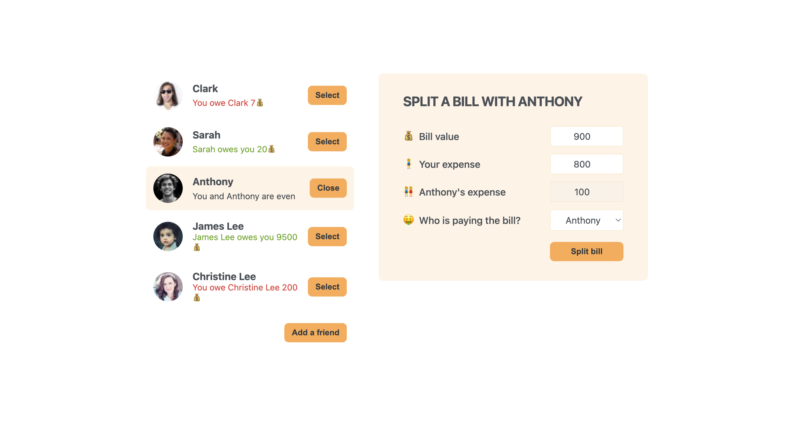

## 🍽️ Eat-n-Split 

Eat-n-Split is a web application designed to simplify the process of splitting bills after a meal or outing. It's implemented using<strong> React</strong> and provides functionalities to input expenses, calculate individual shares, and ensure everyone pays their fair share.

## 🚀 Features

Expense Input: Easily input the total bill amount, tax, tip, and individual items.
Share Calculation: Automatically calculate how much each person owes, including their share of tax and tip.
Modern Interface: User-friendly design that adapts to various screen sizes for a seamless experience.

## 🎮 How to Use

Add Expenses: Input the total bill, tax, and tip amounts.
Input Individual Items: Add items one by one, specifying their price and who consumed them.
Calculate Shares: Once all items are inputted, see a breakdown of how much each person owes.

## 💻 Setup and Running

Install Dependencies: Run npm install to install all required dependencies.
Start the Application: Run npm start. The application will be accessible at http://localhost:3000 or your network IP at port 3000.
Open the App: Open the provided URL in your preferred browser.
